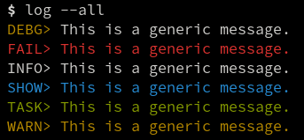

## About

Command for printing nice logging messages in the terminal. \
Lightweight, simple and effective.

## Install
* requires UNIX system & Bash

```bash
git clone github.com/palsmo/cmd-log
cd ./cmd-log/
mv ./log /usr/bin/ # any dir in `PATH`
```

## Info

```
 Usage: log <LOG_TYPE> <MESSAGE> [OPTIONS]
 Print a nice logging message.

 Arguments:
   LOG_TYPE - Type of log (DEBUG, FAIL, INFO, SHOW, TASK, WARN)
   MESSAGE  - Text message

 Options:
   -n       - Do not output trailing newline
   -e       - Exit after logging

 Aware:
    'export DEBUG=true' for LOG_TYPE `DEBUG` to print.

 Example:
   log INFO 'This is a generic message.'
   log FAIL 'This is a generic message.' -e
```

## Screenshots

<div>
    
</div>
